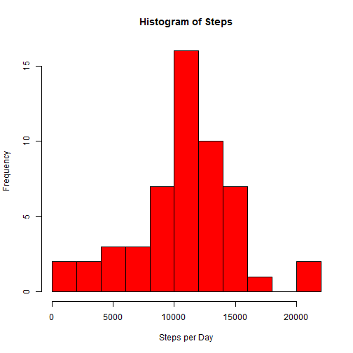
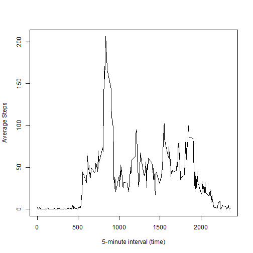
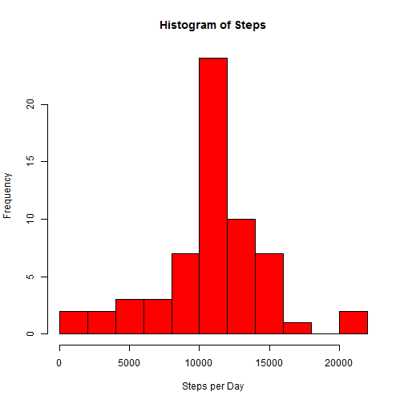
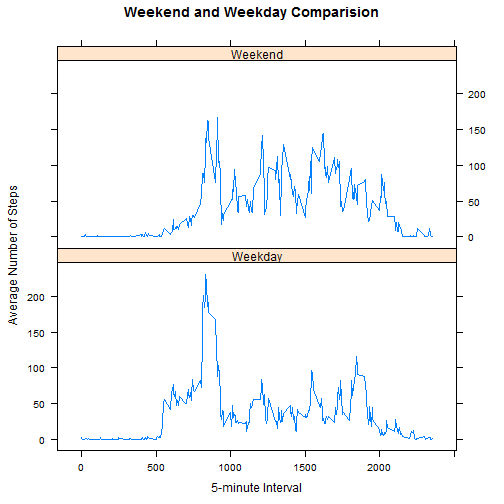

Reproducible Research: Peer Assessment 1
========================================
The goal of this assignment is to analyze the activity recorded by personal acitivity monitoring devices

## Loading and preprocessing the data
The data set (activity.csv) is located in a zip file (activity.zip).  Read in the CSV file that contains 
the following three variables.  Note: the date variable will need to be converted to a POSIXlt class.
- steps (int): Number of steps taking in a 5-minute interval (missing values are coded as NA)
- date (date): The date on which the measurement was taken in YYYY-MM-DD format
- interval (int): Identifier for the 5-minute interval in which measurement was taken

```r
activity <- read.csv( unz("activity.zip", "activity.csv"), 
                      colClasses=c("integer", "character", "integer"),
                      stringsAsFactors=F)

activity$date2 <- strptime( activity$date, format="%Y-%m-%d")

str(activity)
```

```
## 'data.frame':	17568 obs. of  4 variables:
##  $ steps   : int  NA NA NA NA NA NA NA NA NA NA ...
##  $ date    : chr  "2012-10-01" "2012-10-01" "2012-10-01" "2012-10-01" ...
##  $ interval: int  0 5 10 15 20 25 30 35 40 45 ...
##  $ date2   : POSIXlt, format: "2012-10-01" "2012-10-01" ...
```


## What is mean total number of steps taken per day?
We will start by plotting a histogram of the **total** steps taken per day and then calculating the mean of the steps per day.  Since the data is captured in 5 minute intervals, we will need to aggregate by the date variable. 


```r
dateAgg <- aggregate( steps ~ date,
                      data=activity,
                      FUN=sum) 
hist(dateAgg$steps, 
     main="Histogram of Steps", 
     xlab="Steps per Day", 
     col="red",
     breaks=10)
```

 


###Calculate the **Mean** and **Median** of **Steps Per Day** without NA's

```r
mean(dateAgg$steps)
```

```
## [1] 10766
```

```r
median(dateAgg$steps)
```

```
## [1] 10765
```

## What is the average daily activity pattern?
In this section, we will analyze the average number steps per 5-minute interval and plot as a line graph. We will have to aggregate by the interval

```r
intervalAgg <- aggregate(steps ~ interval, data=activity, FUN=mean)

plot(x=intervalAgg$interval, 
     y=intervalAgg$steps, 
     type="l",
     xlab="5-minute interval (time)",
     ylab="Average Steps")
```

 

Get the interval with the **maximum** number of steps.  We will order the data set by number of steps (descending) and take the first row in the list

```r
maxStepsInterval <- intervalAgg[order(-intervalAgg$steps),][1:5,]
maxStepsInterval
```

```
##     interval steps
## 104      835 206.2
## 105      840 195.9
## 107      850 183.4
## 106      845 179.6
## 103      830 177.3
```

Interval **#835** has highest average of steps with **206.1698** steps
 
## Imputing missing values
There are a number of days/intervals where there are missing values. The presence of missing days may introduce bias into some calculations or summaries of the data.

### Number of Missing Steps
We can sum the is.na() method to get the number of missing steps

```r
numberMissing <- sum(is.na(activity$steps))
numberMissing
```

```
## [1] 2304
```

We need to replace missing values for the **step** variable.  We will use the average step count for the observation's 5-minute interval and create a new data set that is identical to the original **activity** dataset, but with the missing values replaced. NOTE: there are some intervals that do not have any data.  In those scenarios, we will replace the NA with 0. 


```r
newSteps <- apply(activity[,c(1,2,3)], 
                  1,
                  FUN = function(x) {
                         if (is.na(x[1]))
                         {
                              meanRow <- subset(intervalAgg, 
                                                intervalAgg$interval == as.integer(x[3]))
                              if (nrow(meanRow) > 0)
                                   newstep <- meanRow[1,]$steps
                              else
                                   newstep <- 0
                         }
                         else
                              newstep <- x[1]
                         
                         newstep
               
               })

completeActivity <- activity
completeActivity$steps <- as.numeric(newSteps)
```

### New Data Set (completeActivity)

```r
str(completeActivity)
```

```
## 'data.frame':	17568 obs. of  4 variables:
##  $ steps   : num  1.717 0.3396 0.1321 0.1509 0.0755 ...
##  $ date    : chr  "2012-10-01" "2012-10-01" "2012-10-01" "2012-10-01" ...
##  $ interval: int  0 5 10 15 20 25 30 35 40 45 ...
##  $ date2   : POSIXlt, format: "2012-10-01" "2012-10-01" ...
```

```r
head(completeActivity)
```

```
##     steps       date interval      date2
## 1 1.71698 2012-10-01        0 2012-10-01
## 2 0.33962 2012-10-01        5 2012-10-01
## 3 0.13208 2012-10-01       10 2012-10-01
## 4 0.15094 2012-10-01       15 2012-10-01
## 5 0.07547 2012-10-01       20 2012-10-01
## 6 2.09434 2012-10-01       25 2012-10-01
```


### Histogram of Total Steps per Day (completedActivity)
We will re-analyze the **total** steps taken per day with a new histogram.  

```r
completeDateAgg <- aggregate( steps ~ date,
                      data=completeActivity,
                      FUN=sum) 
hist(completeDateAgg$steps, 
     main="Histogram of Steps", 
     xlab="Steps per Day", 
     col="red",
     breaks=10)
```

 
The distribution didn't change that much. However, the frequency of the mean value increased which will change the standard deviation of the distribution. 


### Calculate the **Mean** and **Median** of **Steps Per Day** (completeActivity)
As you can see, since we used the mean of the intervals, the average steps per day did not change, however, the median increased by 1 step per day to match the mean. 

```r
mean(completeDateAgg$steps)
```

```
## [1] 10766
```

```r
median(completeDateAgg$steps)
```

```
## [1] 10766
```


## Are there differences in activity patterns between weekdays and weekends?
First we will create a new factor variable (dayType) to distinguish weekdays from weekends

```r
z <- ifelse( weekdays(completeActivity$date2) %in% c('Saturday','Sunday'), "Weekend","Weekday")
completeActivity$dayType <- as.factor(z)
str(completeActivity)
```

```
## 'data.frame':	17568 obs. of  5 variables:
##  $ steps   : num  1.717 0.3396 0.1321 0.1509 0.0755 ...
##  $ date    : chr  "2012-10-01" "2012-10-01" "2012-10-01" "2012-10-01" ...
##  $ interval: int  0 5 10 15 20 25 30 35 40 45 ...
##  $ date2   : POSIXlt, format: "2012-10-01" "2012-10-01" ...
##  $ dayType : Factor w/ 2 levels "Weekday","Weekend": 1 1 1 1 1 1 1 1 1 1 ...
```

```r
head(completeActivity)
```

```
##     steps       date interval      date2 dayType
## 1 1.71698 2012-10-01        0 2012-10-01 Weekday
## 2 0.33962 2012-10-01        5 2012-10-01 Weekday
## 3 0.13208 2012-10-01       10 2012-10-01 Weekday
## 4 0.15094 2012-10-01       15 2012-10-01 Weekday
## 5 0.07547 2012-10-01       20 2012-10-01 Weekday
## 6 2.09434 2012-10-01       25 2012-10-01 Weekday
```


Now we will aggregate the new dataset by interval and daytype and use lattice to create an xyplot to compare the daily activity on weekends and weekdays

```r
intervalAgg <- aggregate(steps ~ interval + dayType, data=completeActivity, FUN=mean)

library(lattice)
xyplot(steps ~ interval | dayType, data=intervalAgg, type="l", layout=c(1,2), xlab="5-minute Interval", ylab="Average Number of Steps", main="Weekend and Weekday Comparision")
```

 

In the above chart, it appears that on weekdays, acitivity starts around 5:00AM whereas on weekends, the activity starts later around 8:00AM.  Also, on weekdays, there is an extreme spike in the mornings that doesn't exist on weekends. 


